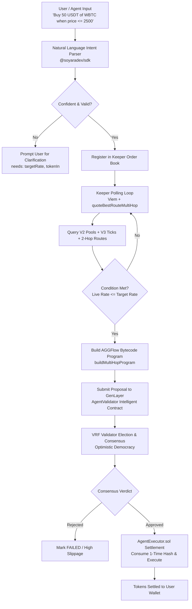

# ⚡ Soyara Intent-Based Limit Order & Conditional Trigger Keeper

> **Autonomous AI-native DeFi keeper daemon and limit order system on GenLayer Bradbury Testnet (`Chain ID: 4221`) using `@soyaradex/sdk`, `viem`, and Next.js / TypeScript.**

---

## 📖 Table of Contents

1. [System Overview](#1-system-overview)
2. [Key Innovations & Philosophy](#2-key-innovations--philosophy)
3. [Architecture & Execution Pipeline](#3-architecture--execution-pipeline)
4. [How the Keeper Engine Works](#4-how-the-keeper-engine-works)
5. [GenLayer AI Consensus Validation](#5-genlayer-ai-consensus-validation)
6. [Multi-Hop Routing & AGGFlow Bytecode](#6-multi-hop-routing--aggflow-bytecode)
7. [SDK & Viem Integration Guide](#7-sdk--viem-integration-guide)
8. [Deployed Contract & Token Addresses](#8-deployed-contract--token-addresses)
9. [Getting Started & Development](#9-getting-started--development)

---

## 1. System Overview

**Soyara Intent Keeper** allows users and autonomous agents to formulate complex conditional trading intents in natural language (e.g., *"Buy 50 USDT of WBTC when WBTC price <= 2500 USDT"*, *"Take profit on 10 FSWP when price reaches 15.0 USDC"*, or *"Stop loss on 1 WBTC when price <= 2200 USDT"*).

The daemon runs an autonomous monitoring loop that:
1. **Parses & Extracts Constraints**: Uses `@soyaradex/sdk` to extract tokens, amounts, trigger operators (`<=`, `>=`, `==`), and slippage tolerances with zero dangerous guessing.
2. **Monitors Live Liquidity via Viem**: Periodically queries real-time quotes against Bradbury testnet V2 and V3 AMM pools with multi-hop route aggregation (`WBTC → WGEN → USDT`).
3. **Consensus-Gated Execution**: Upon trigger condition satisfaction, the proposal is verified by GenLayer Intelligent Contracts (`AgentValidator`) through VRF-elected validator consensus.
4. **On-Chain Settlement**: Once validated, the EVM `AgentExecutor` and `AGGFlowRouter` execute the trade, consuming a one-time cryptographic hash to prevent replay attacks.

---

## 2. Key Innovations & Philosophy

* **Never Guess on Under-Specified Requests**: If an intent omits key parameters (e.g. source token or target price), the parser returns `confident: false` and a `needs` list, protecting funds.
* **Execution-Accurate Quoting**: Quotes are lower bounds on actual fill amounts. V3 quotes use the live Quoter contract (`quoteExactInputSingle`) walking ticks and price impact rather than spot-price approximations.
* **Aggregated Route as an Outcome**: Swaps are not hardcoded to V2 or V3. The SDK compares direct V2, direct V3 (at all fee tiers: 500, 3000, 10000), and 2-hop paths (via WGEN, USDC, USDT) and picks the route delivering the highest output.
* **Consensus-Gated Safety**: Trades cannot settle on `AgentExecutor.sol` without a verifiable, on-chain approved verdict from the GenLayer `AgentValidator` Intelligent Contract.

---

## 3. Architecture & Execution Pipeline



---

## 4. How the Keeper Engine Works

The Keeper daemon executes a recurring heartbeat cycle (default: 4 seconds):

1. **Order Iteration**: Loops through all orders with status `PENDING`.
2. **Quote Simulation**: Calls `quoteBestRouteMultiHop` on the Bradbury testnet RPC (`https://rpc-bradbury.genlayer.com`).
3. **Execution Rate Calculation**:
   $$\text{Execution Rate} = \frac{\text{Amount In}}{\text{Amount Out}}$$
4. **Condition Evaluation**:
   - `LTE` ($\le$): Triggers when $\text{Current Rate} \le \text{Target Rate}$ (e.g., Limit Buy, Stop Loss).
   - `GTE` ($\ge$): Triggers when $\text{Current Rate} \ge \text{Target Rate}$ (e.g., Limit Sell, Take Profit).
5. **State Transition**: Transitions `PENDING` $\rightarrow$ `TRIGGERED` $\rightarrow$ `VALIDATING` $\rightarrow$ `EXECUTED`.

---

## 5. GenLayer AI Consensus Validation

Every trade proposal is verified by GenLayer's `AgentValidator.py` running in the **GenVM**:
* **Equivalence Principle Consensus (`gl.eq_principle.strict_eq`)**: Multiple validator nodes independently simulate the proposal and must strictly agree on output parameters.
* **Safety Invariants**:
  - `slippageBps <= 300` (max 3% tolerance).
  - Both `tokenIn` and `tokenOut` must belong to the whitelisted token registry.
  - The settlement destination must be the verified `AGGFlowEntrypoint` or `AgentExecutor`.
* **One-Time Consumption Hash**: `AgentExecutor.sol` binds a hash over the exact trade parameters and validator proposal ID, consuming it during execution to prevent re-entrancy and replay.

---

## 6. Multi-Hop Routing & AGGFlow Bytecode

When trading pairs without direct pools (such as `WBTC/USDT`), the SDK builds a multi-hop program bytecode:

| Opcode | Meaning | Action |
|---|---|---|
| `0x02` | Pull From User | Pulls `tokenIn` from user wallet into router |
| `0x01` | Held Balance | Uses tokens already held by the router for intermediate hops |
| `0x03` | Wrap / Unwrap | Handles native `GEN` $\leftrightarrow$ `WGEN` conversion |
| `0x00` | Univ2 Swap | Executes V2 constant-product swap |
| `0x01` | Univ3 Swap | Executes V3 concentrated liquidity swap |

---

## 7. SDK & Viem Integration Guide

### Installation
```bash
npm install @soyaradex/sdk viem
```

### Parsing Intents & Quoting in One Call
```typescript
import { understand } from '@soyaradex/sdk';

const { intent, quote, amountInWei } = await understand('swap 50 USDC to USDT');

if (!intent.confident) {
  console.log('Missing parameters:', intent.needs.join(', '));
} else {
  console.log(`Action: ${intent.action}, Route: ${quote.dex}`);
  console.log(`Expected Output: ${quote.amountOutRaw.toString()}`);
}
```

### Multi-Hop Quote & Calldata Building
```typescript
import { quoteBestRouteMultiHop, buildMultiHopProgram, tokenBySymbol } from '@soyaradex/sdk';
import { parseUnits } from 'viem';

const wbtc = tokenBySymbol('WBTC')!;
const usdt = tokenBySymbol('USDT')!;
const wgen = tokenBySymbol('WGEN')!;

const amountInWei = parseUnits('1', wbtc.decimals);

// Query best route including 2-hop candidates (via WGEN, USDC, USDT)
const quote = await quoteBestRouteMultiHop(wbtc.address, usdt.address, amountInWei, 'best');

// Generate AGGFlow bytecode
const programHex = buildMultiHopProgram(
  { address: wbtc.address, isNative: false },
  { address: usdt.address, isNative: false },
  quote.hops,
  wgen.address
);

console.log('Calldata:', programHex);
```

---

## 8. Deployed Contract & Token Addresses

### Network: GenLayer Bradbury Testnet (`Chain ID: 4221`)
* **RPC URL**: `https://rpc-bradbury.genlayer.com`
* **Explorer**: `https://explorer-bradbury.genlayer.com`

### Core & Intelligent Contracts
| Contract | Type | Address |
|---|---|---|
| `AgentValidator` | GenLayer Intelligent Contract | `0x7ABa94668afC24463Be323f9bB65BD4b4F480d89` |
| `LiquidityValidator` | GenLayer Intelligent Contract | `0xEFb9473B5269A79d72Df4b6E73E310791a185eeC` |
| `AgentExecutor` | EVM Settlement Gate | `0xa835c0a86dD64726eF23D83a8ca7D60b542EE2e4` |
| `AGGFlowEntrypoint` | Aggregator Entrypoint | `0x95feE6Cb918Ed9C621E36082EE8D998873031EaA` |
| `AGGFlowRouter` | Aggregator Router | `0xafCAD2bf0E85e30a2b54ac6491dC81987cE7767C` |
| `V2 Factory` | UniswapV2 Factory | `0x4680BCe1632824d30D2F53656dD610736c3e312e` |
| `V3 Factory` | UniswapV3 Factory | `0xBd959038300aF0C8dd1873E497d6D0a565b4E246` |
| `V3 Quoter` | UniswapV3 Quoter | `0xca4914407868bc37ccbE324cA149DD475d39A2Bf` |

### Whitelisted Testnet Tokens (18 Decimals)
| Symbol | Address | Decimals |
|---|---|---|
| `GEN` (Native) | `0x0000000000000000000000000000000000000000` | 18 |
| `WGEN` | `0x315374AA9b5536037Cc1Efeea2439CCC0913A77e` | 18 |
| `USDC` | `0x58B6CD7891cd0A682226E25607b958a6479195A6` | 18 |
| `USDT` | `0x4B54235778c26Ee8ac27744A53d4c5BC4c9D46fc` | 18 |
| `WBTC` | `0x723534bc6C2B536fF5D0455111513A9431c44e25` | 18 |
| `ETH` | `0x0F56b4E7f4e2cf346a94aB9263Ed3F3644db7c0C` | 18 |
| `FSWP` (Soyara) | `0xA2eC9aAf2235C66491767e69eBBD885469697B3E` | 18 |

---

## 9. Do You Need a Server?

| What | Needs a key? | Needs a server? | Where it runs |
|---|---|---|---|
| `parseIntent` (Intent NLP) | No | **No** | Browser / Node.js |
| `quoteBestRouteMultiHop` (Quotes via Viem) | No | **No** | Public GenLayer RPC (`https://rpc-bradbury.genlayer.com`) |
| `buildMultiHopProgram` (Calldata Builder) | No | **No** | Pure bytecode generation |
| **Interactive UI Keeper** | No | **No** | Runs directly in Next.js browser tab |
| **24/7 Headless Daemon** | Optional | **Yes** | Run `npm run keeper` in Node.js / Docker / VPS |
| `AgentValidator` Write (`validate`) | Yes (Funded GenLayer account) | **Yes** | Server API route (`/api/validate`) |
| `AgentExecutor` Settlement (`settleSwap`) | Yes (Authorized Agent key) | **Yes** | Server API route (`/api/execute`) |

---

## 10. Getting Started & Development

### 1. Run the Interactive Next.js App
```bash
npm run dev
```
Open [http://localhost:3000](http://localhost:3000) to view the live dashboard.

### 2. Run the Headless 24/7 Keeper Daemon
For autonomous background monitoring without a browser session:
```bash
npm run keeper
```

### 3. Type Checking & Production Build
```bash
npm run typecheck
npm run build
```
